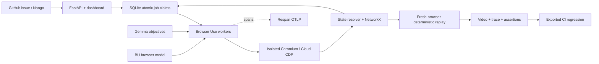

# SwarmCI

A shared browser-exploration swarm: agents explore interaction sequences, share discovered states and replay paths, and verify suspected workflow failures. CI turns the captured evidence into executable regression checks.

## Hackathon demo

- [Live exploration dashboard](https://swarmci.vercel.app)
- [Recorded Gemma exploration of real Plane: 31 actions, 32 states](https://swarmci.vercel.app/?run=81f34d91d3eb)
- [Penpot browser evidence and comparison](https://swarmci.vercel.app/static/review.html)
- [Demo issues and recordings across 21 repositories](https://github.com/drPod/swarmci-demo/issues)
- [Penpot regression PR with GitHub checks](https://github.com/drPod/swarmci-demo/pull/24)

This repository contains the application source. `drPod/swarmci-demo` contains the
published demo issues and regression PRs. The Plane swarm has not verified a bug.
Penpot, Excalidraw, tldraw, and Logseq have reproduced behavior from known reports;
new-bug discovery and a performance advantage over a single agent are not established.
Recorded playback is labeled separately from live exploration.

## Local setup

The app requires Python 3.12+, uv, and Bun 1.3.14. Bun manages JavaScript dependencies and runs the Nango bridge; uv manages the Python backend.

```sh
bun install --cwd integrations --frozen-lockfile
uv sync --frozen
uv run playwright install chromium
uv run swarmci serve
# Open http://127.0.0.1:8080
```

Select **Component Lab**, then **Start exploration**. This uses real Chromium workers and a deliberately faulty local fixture. It needs no inference service or API keys. The fixture is visibly labeled and is not a reproduction of Penpot.

The dashboard shows the shared state graph, every recorded transition, cross-worker handoffs, event stream, findings, and recordings. Click a node to inspect its arrival paths. **Export CI test** downloads a self-contained project with a replay manifest, Python test, locked dependencies, and GitHub Actions workflow.

## Run a regression

```sh
uv run swarmci replay path/to/replay.json --target-url http://your-test-app --output artifacts/ci
```

Exit codes: **0** assertions pass; **1** product failure; **2** replay or infrastructure error. A test with no assertions cannot pass. Videos, final screenshots, Playwright traces, Markdown/HTML reports, and JUnit XML are written to the output directory. Open a trace with `uv run playwright show-trace artifacts/ci/trace.zip`.

Place exported manifests under `regressions/` and set the repository variable `SWARMCI_TARGET_URL` to an isolated test deployment. The exported GitHub Actions workflow (`infra/regression.workflow.yml`) replays them on pull requests and uploads evidence even on failure. It also supports a manual target URL. CI replays use Playwright and require no model inference. Recorded selectors/coordinates can drift as the app changes; drift is a runner error, not an automatically verified product bug.

## Architecture



- `swarmci/store.py`: SQLite WAL is the durable source of truth. Atomic `UPDATE ... RETURNING` prevents duplicate claims. NetworkX provides the multigraph. Every action attempt and arrival path is retained, including self-loops and converging paths.
- `swarmci/state.py`: screen grouping and exact state identity are separate. Controls, field values, disabled/selected states, dialogs, route, storage digest, and an optional target-specific application probe participate in identity. Without a probe, full history is conservatively included. Storage contents are hashed before persistence. A state probe is a target-supplied completeness assumption, not proof of behavioral equivalence.
- `swarmci/runner.py`: bounded worker/job/depth/time budgets, shared continuation jobs, checkpoint replay verification, clean-session bug verification, cancellation, explicit restart interruption. Each worker can inherit a path discovered by another.
- `swarmci/agents.py`: Browser Use 0.12.9 and the BU model drive discovery, one action per step. Gemma proposes diverse continuation objectives. Hooks compile supported actions into portable replay primitives. Unsupported actions fail closed. Context-menu clicks and canvas drags use registered Browser Use tools.
- `swarmci/browser.py`: Playwright owns browser isolation, recording, traces, and model-free replay. Browser Use attaches through CDP. Clicks, inputs, selections, keyboard shortcuts, scrolling, history, navigation, uploads, and canvas drags are supported. Multi-tab and cross-frame portable replay still need adapters.
- `swarmci/adapters/`: GitHub import through Nango (public GitHub fallback), an explicit-call GitHub export helper, Respan SDK traces, and AgentMail inbox/read APIs for the later email product. Exploration does not publish issues or send messages.

Checkpoint inheritance currently means replay, **not browser/database snapshot cloning**. The system shares discovered prefixes and continuation scheduling but still pays their browser execution cost. Do not interpret handoff counts as saved browser actions. Arbitrary server state is not cloned. Parallel real targets need independently prepared, resettable test accounts/data; declaring an isolation mode alone does not provision them. Use one worker until that setup exists. Run multiple coordinator processes only after adding expiring leases; the shipped server is one coordinator with concurrent workers and restart recovery, not a distributed cluster.

## Models on Lambda

`.env` holds local secrets and is ignored by Git. The infrastructure API key is separate from the inference server keys. The local fixture and CI replay work without either model.

The selected deployment is one H100 80 GB for BU and one A10 24 GB for Gemma 3 4B. At the availability check during this build, those were $3.29/hour and $1.29/hour. Capacity and prices can change. No GPU is needed for local replay.

`uv run python scripts/lambda_status.py` checks existing instances. `scripts/provision_lambda.py` records the explicitly selected instance IDs under ignored `.secrets/` and skips roles already recorded. It is a billable launch script; do not run it just to start the local product. The initial launch failed billing-address validation. After the address was corrected, both selected instances were created. Model installation/readiness is tracked by `scripts/deploy_models.py`. Use `uv run python scripts/terminate_lambda.py --confirm` to stop the two recorded instances when finished.

`infra/models.compose.yml` is a two-GPU, Linux/NVIDIA deployment alternative for BU and Gemma 12B. It is not suitable for macOS, and it is not the selected H100+A10 deployment. Gemma's official weights need Hugging Face access. Set BU/Gemma URLs and inference keys in `.env`; restart the server after changes. Use `scripts/deploy_models.py` for the selected separate-host deployment and `scripts/connect_models.py --tunnel` to reconnect tunnels. Browser Use Cloud requires its own key and has not been live-tested.

## Penpot #11656

The actual public issue is saved in `targets/penpot-11656.issue.json`. The target template is `targets/penpot-11656.json` and deliberately has `seed_ready: false`.

To validate it:

1. Start a controlled Penpot deployment or supply a disposable test-account deployment. Prepare authentication using a Playwright storage-state file.
2. Set the target URL to a reproducible file/setup and `storage_state` to the local auth file. Validate the error-screen selector against that version.
3. Add positive, target-specific assertions for the expected restored component and usable editor. Use an assertion’s `after_action` field (a label/selector substring such as `Reset overrides`) for expectations that only apply after a particular operation. Do not use error-screen absence alone as proof that reset worked.
4. Configure a fresh-file setup for each replay, then enable `seed_ready`. Use one worker until independent backend/account fixtures are provided.
5. Start Browser Use exploration. The imported issue guides the grouped component → copy → nested swap → reset sequence. Compare it with the ungrouped control.

**Penpot has not yet been independently reproduced by this build.** Its target selectors are a template, not a validated regression. The local pipeline is tested against the controlled fixture, including a working `?fixed=1` variant.

## Validation

```sh
uv run pytest
uv run ruff check swarmci tests scripts
```

Tests run real Chromium: shared exploration discovers and verifies the seeded failure, the exported regression fails on the buggy version and passes on the fixed version, state probes retain hierarchy differences, and the Browser Use hooks record a replayable action with scripted offline inference. Unit tests cover atomic claims, path retention, isolation checks, rejected unsupported actions, and restart handling. This does not establish live model quality or Penpot reproducibility.

Artifacts include browser-visible content, network traces, and potentially test-session data. Keep evidence local until reviewed. The API binds to localhost; add authentication, tenant isolation, artifact access control, and object storage before offering it as a hosted service.

## Upstream components and references

Browser Use (MIT): https://github.com/browser-use/browser-use · model configuration: https://huggingface.co/browser-use/bu-30b-a3b-preview · Playwright (Apache-2.0): https://github.com/microsoft/playwright-python · NetworkX (BSD-3-Clause): https://networkx.org · Nango proxy: https://nango.dev/docs/reference/backend/http-api/proxy/get · Respan SDK: https://respan.ai/docs/sdks/python-sdk/overview · AgentMail messages: https://docs.agentmail.to/api-reference/inboxes/messages/list · Penpot issue: https://github.com/penpot/penpot/issues/11656

No browser-whiskor or Crawljax source is copied. Existing engines are dependencies; the repository contains the coordinator, adapters, evidence pipeline, and product UI.

## Respan telemetry

Respan is initialized once per process from `.env`, before model clients are created.
The official `respan-ai==4.2.3` SDK and `respan-instrumentation-openai==1.2.2`
export nested spans for both CLI commands and API background runs. Missing keys or
`RESPAN_ENABLED=false` leave the app usable without exporting. `RESPAN_BASE_URL`
defaults to `https://api.respan.ai/api`; the old `RESPAN_ENDPOINT` full-URL override
is still accepted. Restart a running server after changing `.env`.

A dashboard trace is organized as:

```text
Explore · <target> · <count> verified bugs
  Worker 01 · Browser explorer
    Branch 01 · <exploration objective>
      Open browser session
      01 · Restore starting state
        Replay prefix · N actions
        Observe and fingerprint state
        Graph · Add new state / Merge existing state
      02 · Explore · <action or model>
        Browser: click — <control>
        New state / Known state · <screen>
          Assertions · N passed / N failed
          Plan next branches · N queued
          Confirmed bug · <failed assertion>
            Replay reproduced failure
      Save evidence and close browser
  Worker 02 · Browser explorer
  Worker 03 · Browser explorer
```

Workers group all their numbered branches in one collapsible timeline. Branch
inputs show the objective and inherited checkpoint; outputs show the final screen,
actions explored, observed browser errors, and evidence directory. The run summary
contains a plain-language result, coverage, and a list of verified findings. Model
spans are labeled `LLM · <model>` beneath their planning or browser-agent context.
These labels apply to newly emitted traces; existing stored traces are retained.


The fixture uses deterministic actions and objectives, so its traces contain no
LLM calls. Independent API-launched runs have their own root trace; `run_id` is
also the Respan thread identifier. Job, worker, checkpoint, engine, and budget
metadata propagate to nested spans. Run outputs show states, transitions,
convergence, handoffs, depth, verified bugs, and job totals. Verification and replay
outputs show product assertion results and local artifact references. A detected
product bug is a verification result; infrastructure exceptions produce error
spans. Cancellation is labeled separately.

Application spans use explicit summaries instead of serializing function arguments:
storage, cookies, action field values, and connector response bodies are not copied
into them. The official model instrumentor captures model prompts and responses,
which can include page content and images. Tokens and latency come from model
responses; Lambda GPU-hour billing is separate and is not inferred from token counts.
SDK batching flushes on CLI exit and after API workers stop during shutdown. This
is an in-memory queue; use Respan's collector if durable delivery is required.

Setup and inspection use the official CLI (the setup installs Respan's agent skill):

```sh
bunx --bun @respan/cli@0.14.1 setup tracing --agent codex-cli --no-instrument --base-url https://api.respan.ai
bunx --bun @respan/cli@0.14.1 setup doctor
uv run python scripts/respan_smoke.py
bunx --bun @respan/cli@0.14.1 traces list --limit 5
bunx --bun @respan/cli@0.14.1 traces get TRACE_ID
```

The smoke check runs three real local Chromium workers, verifies the seeded bug,
and exports the actual run to the configured Respan account. It saves evidence
under `artifacts/` and a separate `data/respan-smoke.db`. It does not require live
model endpoints. Offline tests cover the SDK's actual JSON export, span hierarchy,
concurrent context isolation, errors, cancellation, and instrumented model usage.

SDK references: [initialization](https://respan.ai/docs/sdks/python-sdk/initialize),
[OpenAI-compatible model tracing](https://respan.ai/docs/integrations/openai-sdk).

## Nango CI demo

Open `http://127.0.0.1:8080/static/integrations.html` for connected accounts, provider discovery, catalog actions, and evidence publishing.

- Live repository: https://github.com/drPod/swarmci-demo
- Verified fixture issue with animated replay and MP4: https://github.com/drPod/swarmci-demo/issues/1
- Draft regression PR with the same evidence: https://github.com/drPod/swarmci-demo/pull/2
- Actual CI run: https://github.com/drPod/swarmci-demo/actions/runs/34721920614 — buggy product fails its assertion; fixed product passes. Both upload fresh browser evidence.

This demonstration uses Component Lab, not a confirmed Penpot reproduction.

Install the integration dependency with `bun install --cwd integrations --frozen-lockfile`. The Python backend uses a small stdin/stdout bridge to the official `@nangohq/node` SDK. GitHub import, issue creation, PR creation, workflow-job retrieval, and CI comments use Nango's **unmodified, deployed catalog actions**. Git/`gh` handles committing and pushing regression files using the locally authenticated GitHub CLI. FFmpeg produces MP4 and animated GIF evidence. GitHub bodies show the GIF preview and link to the full MP4; this does not use GitHub's private attachment-upload API.

Nango owns account authorization, token refresh, action execution, and provider proxying. JSON Editor renders action forms directly from Nango's published JSON Schemas. The template deployment endpoint is called directly because the installed SDK has no method for it. No custom Linear/Jira/Zendesk API mapping is implemented.

To add a ticketing system, configure its integration in Nango, refresh the catalog, authorize the account with Connect, and enable the desired existing catalog actions. The UI supports issue/ticket creation, comments, attachments, and discovery actions. Currently only GitHub is connected and live-tested; browsing another provider's catalog does not imply that account is connected. Secrets stay in the gitignored `.env`, never in the demo repository or browser.

The Nango configuration uses `NANGO_SECRET_KEY`, `NANGO_CONNECTION_ID`, and `NANGO_PROVIDER_CONFIG_KEY`. Publish requests retain receipts so retrying a completed publication reuses the issue and PR.

## Real Penpot review (verified local evidence)

Open **http://localhost:8080/static/review.html** from the atlas's **Penpot review** link. This view uses GitHub Primer and the existing tiny-browser-agent media components. It shows the reported issue, tested variant, full failure/control recordings, screenshot comparison, per-attempt outcomes, and the GitHub review links.

- Regression PR beside real Penpot source: https://github.com/drPod/penpot/pull/1
- Evidence on the original issue: https://github.com/penpot/penpot/issues/11656#issuecomment-5649227950
- Evidence on the proposed fix: https://github.com/penpot/penpot/pull/11604#issuecomment-5649228082

On official Penpot **2.17.2**, two fresh-file, fresh-browser runs of the **two-intermediate-group** path left Orange Button after Reset overrides. Two direct-child control runs restored Blue Button. The reported error page was not observed. This is a verified functional variant; novelty, shared root cause, and the proposed fix's correctness are not established. These are deterministic Playwright verifications of a UI-prepared document, not autonomous swarm discovery.

The portable regression is `infra/penpot/test_reset.py`, with the native exported `nested-reset.penpot` seed. `infra/penpot/review.workflow.yml` starts the official Docker deployment, runs the test, publishes native checks through `dorny/test-reporter`, uploads artifacts, and maintains the PR review through `marocchino/sticky-pull-request-comment`. Nango's existing actions handle source-context retrieval and publication on the original issue/PR. Fork CI tests the pinned release; it does not compile or validate upstream PR #11604's head.

For the DSPy/explanation integration, consume **`artifacts/penpot-verified/review-data.json`**. It contains source repository/issue/PR, tested version, execution provenance, uncertainty, and per-attempt expected/observed/status fields. `github.json` beside it contains publication links. Keep `failed` (completed product assertion failure) distinct from `error` (incomplete setup/replay). The explanation layer should not infer a new bug, autonomous discovery, or a verified fix from these records.
